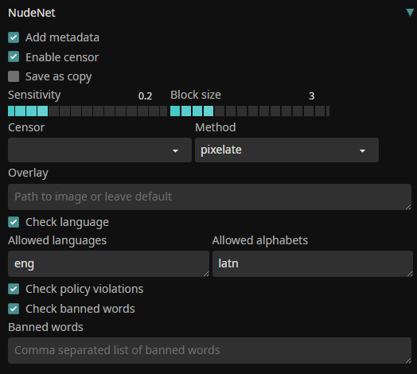
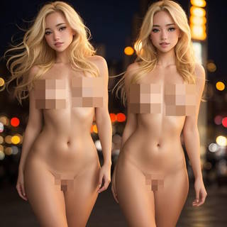

# Censorship... with style! ™

### An extension for [SD.Next](https://github.com/vladmandic/automatic)

## Features

### Main NudeNet

- Detect geneder and any body part  
  e.g. *female face, belly, feet*
- Exposed or unexposed:  
  e.g. *breast or breast-bare*
- Add information to image metadata
  e.g. *"NudeNet: female-face:0.86; belly:0.54"*, *NSFW: True*  
- Censor as desired (or not):
  - blur *(adjust block size for effect)*
  - pixelate *(adjust block size for effect)*
  - cover with pasty (overlay image) :)  
    *note: RGBA image is recommended for overlays*  
- Use as extension from UI or via CLI  
  `python nudenet.py --help`  
- Adjustable sensitivity
- Can be used for **txt2img**, **img2img** or **process**  
- FAST!  
  Uses `CV2` and `ONNX` backend and typically executes in <0.1sec  

### Language Check

If **Check language** is enabled, NudeNet will use `facebook/fasttext-language-identification` to check if prompt is in allowed language and using allowed alphabet.
For example: 
```log
LangDetect: ['eng_latn:0.83']
```

Means that language is English and uses Latin alphabet with 83% confidence.

### Image-Guard

If **Policy check** is enabled, NudeNet will use `LlavaGuard` VLM to check if image violates any policies and reasons why.
For example:
```js
'LlavaGuard': {
  'rating': 'Unsafe',
  'category': 'O3: Sexual Content',
  'rationale': 'The image contains a woman with her body covered in paint splatters, which is considered sexually explicit content. This type of content is not allowed on our platform as it violates our policy against sexually explicit content. The image is not educational in nature and does not provide information on sexuality or sexual education. It is simply a depiction of a woman in a provocative pose, which is not appropriate for our platform.'
}
```

## Settings

Should be self-explanatory...



## Examples



